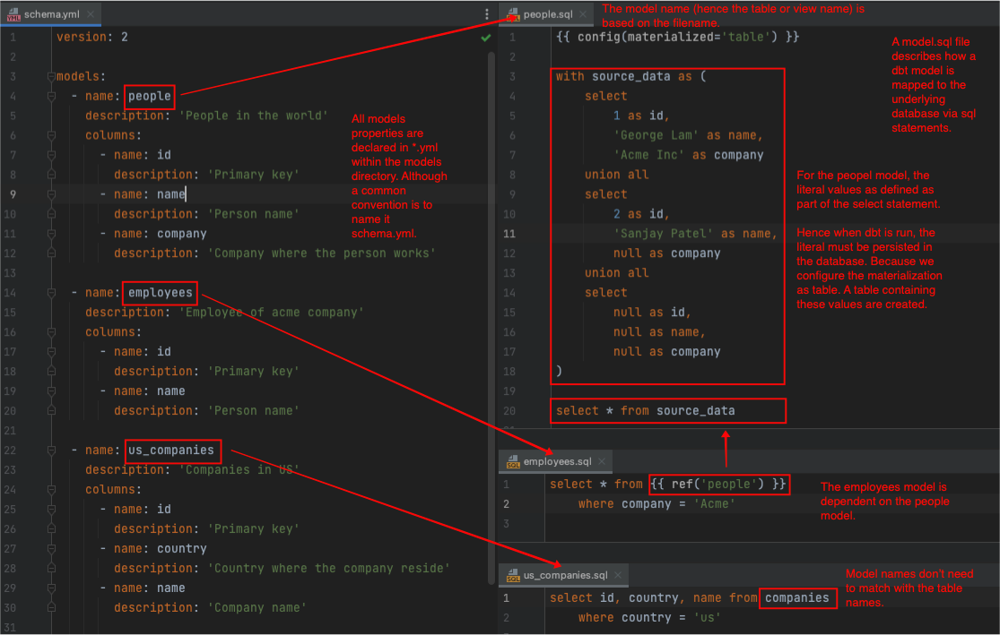

# Basic SQL Modeling

This project focuses on the basics of building dbt models using SQL.

Alternatively, we can also build dbt models using Python, which will be covered in a different project.

## dbt SQL Models

A dbt SQL model is defined in a `.sql` file that encapsulates a select statement that describes a model.



* The `companies` table has been created when launching postgres via docker.
* The `people` table is created when running `dbt run`. See the annotated diagram.
* The `employees` view is created when running `dbt run`.

## Setup

1. Launch the postgres container.

   ```shell
   docker-compose -f ../../docker-compose.yml up
   ```

1. Build the project.

   ```shell
   dbt build
   ```

1. Tear down the postgres container.

   ```shell
   docker-compose -f ../../docker-compose.yml down
   ```

## Notes

* If we change the model name in the files, the new corresponding tables and views bearing the new names will be created. But the old tables won't be dropped. 

## References

* [dbt Docs: About dbt models](https://docs.getdbt.com/docs/build/models)
* [dbt Docs: SQL models](https://docs.getdbt.com/docs/build/sql-models)
* [dbt Docs: Model properties](https://docs.getdbt.com/reference/model-properties)
* [dbt Docs: dbt jinga functions](https://docs.getdbt.com/reference/dbt-jinja-functions)